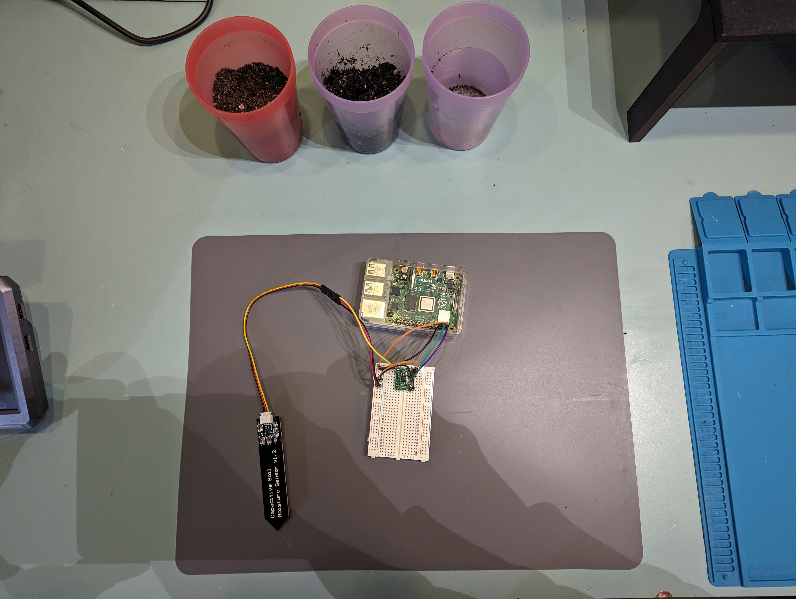
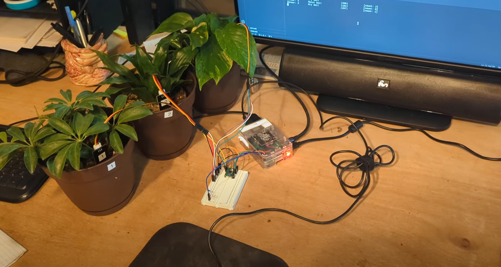
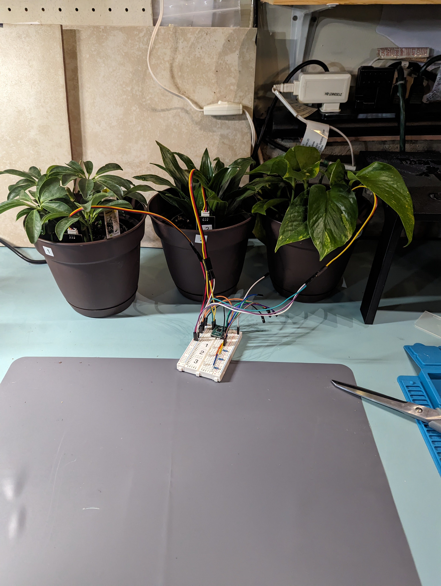
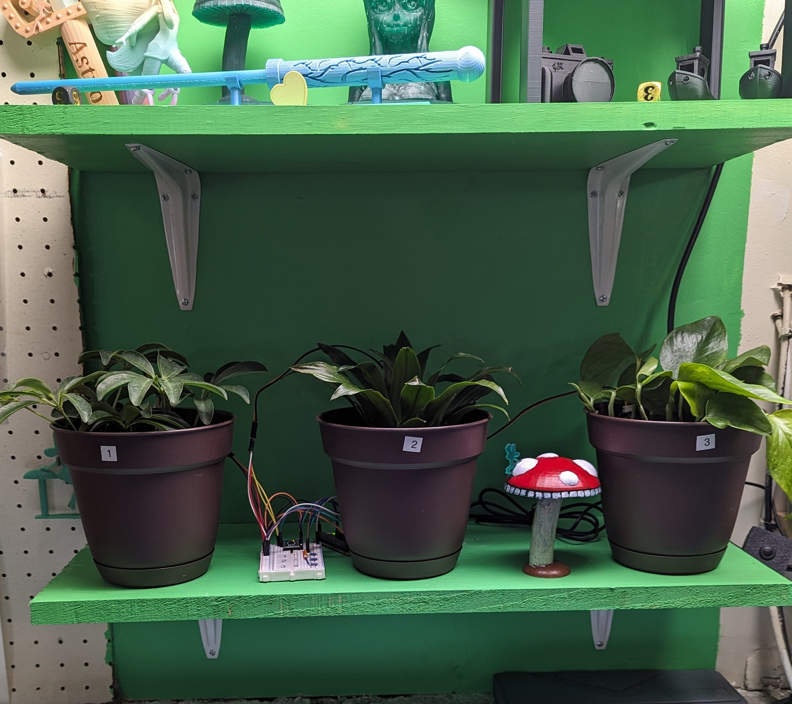

# Plant Care Assistant

Video:

## Project Description

This project was developed to liven up my workspace. I wanted to have some plants, but historically I haven't kept them alive very well. I either over-water or under-water them. On top of that, my workspace gets no natural sunlight, so I wanted to make sure my plants got plenty of light. And lastly, my garage gets chilly in the winter, so I wanted my plants stay warm.

## Accepatance Criteria

**This project, when it is complete will:**

- Support up to 3 plants
- Monitor the moisture levels of the soil of each plant
- Water each plant when the soil is dry AND the soil has had an adequete period of dryness
- Provide adequete lighting for the plants with a timer function
- Log all metrics for debugging and historical reference

**Future State:**

- Provide gentle heat when soil temperature falls too low (future state)
- Smart lighting through feedback from a photo-resistor

## Seting up the Device

### Parts List

| Item                                     | Quantity | Link                                                                                                                                |
| :--------------------------------------- | :------: | :---------------------------------------------------------------------------------------------------------------------------------- |
| Raspberry Pi Zero 2 W (Any Pi will work) |    1     | [Microcenter](https://www.microcenter.com/product/643085/raspberry-pi-zero-2-w)                                                     |
| MicroSD card (For Raspberry Pi)          |    1     | [Microcenter](https://www.microcenter.com/product/658767/micro-center-64gb-ultra-microsdxc-class-10-flash-memory-card-with-adapter) |
| 20x2 Pin Header for Raspberry Pi         |    1     | [Microcenter](https://www.amazon.com/gp/product/B083DYVWDN/ref=ppx_yo_dt_b_search_asin_title?ie=UTF8&)psc=1                         |
| ADS7830 Analog-to-Digital Converter      |    1     | No Link Available                                                                                                                   |
| Capacitive Moisture Sensor(s)            |  1-3\*   | [Amazon](https://www.amazon.com/gp/product/B07SYBSHGX/ref=ppx_yo_dt_b_search_asin_title?ie=UTF8&psc=1)                              |
| Water Pump(s) and Line                   |  1-3\*   | [Amazon](https://www.amazon.com/gp/product/B07TMW5CDM/ref=ppx_yo_dt_b_search_asin_title?ie=UTF8&psc=1)                              |
| 5V USB Grow Light                        |    1     | [Amazon](https://www.amazon.com/gp/product/B0BXKWMTPF/ref=ppx_yo_dt_b_search_asin_title?ie=UTF8&psc=1)                              |
| 5V Relay                                 |  2-4\*   | [Amazon](https://www.amazon.com/gp/product/B09SLS3QT1/ref=ppx_yo_dt_b_search_asin_title?ie=UTF8&psc=1)                              |
| LED                                      |  1-3\*   | [Amazon](https://www.amazon.com/gp/product/B07QXR5MZB/ref=ppx_yo_dt_b_search_asin_title?ie=UTF8&psc=1)                              |
| 220 Ohm Reistor                          |  1-3\*   | [Amazon](https://www.amazon.com/gp/product/B07ZX2CB6B/ref=ppx_yo_dt_b_search_asin_title?ie=UTF8&psc=1)                              |
| Solderless Breadboard                    |    1     | [Amazon](https://www.amazon.com/gp/product/B07PBFPJC6/ref=ppx_yo_dt_b_search_asin_title?ie=UTF8&psc=1)                              |
| Dupont Cables 10cm and 30cm              |   Many   | [Amazon](https://www.amazon.com/gp/product/B01EV70C78/ref=ppx_yo_dt_b_search_asin_title?ie=UTF8&psc=1)                              |

\*Quantity is dependent on how many plants you want to care for.

### Diagram


### Pin Assignments

**Note that all pins are in BCM mode**

| Component                           | Pi/COnnection |    Power     |
| :---------------------------------- | :-----------: | :----------: |
| ADS7830 (or 1115)                   |     2, 3      |  3.3V (Pi)   |
| Capacitive Moisture Sensor v 1.2 #1 |   A0 (ADS)    |  3.3V (Pi)   |
| Capacitive Moisture Sensor v 1.2 #1 |   A1 (ADS)    |  3.3V (Pi)   |
| Capacitive Moisture Sensor v 1.2 #1 |   A2 (ADS)    |  3.3V (Pi)   |
| LED #1                              |      17       |  3.3V (Pi)   |
| LED #2                              |      27       |  3.3V (Pi)   |
| LED #3                              |      22       |  3.3V (Pi)   |
| Pump **Relay** #1                   |       5       |   5V (Pi)    |
| Pump **Relay** #2 (Optional)        |       6       |   5V (Pi)    |
| Pump **Relay** #3 (Optional)        |      13       |   5V (Pi)    |
| Light Relay                         |      23       | 5V (**USB**) |
| Water Pump #1                       |    Relay 1    | 5V (**USB**) |
| Water Pump #2 (Optional)            |    Relay 2    | 5V (**USB**) |
| Water Pump #3 (Optional)            |    Relay 3    | 5V (**USB**) |

### Set Up the Pi

[See my github tutorial on how to set up the Raspberry Pi Zero 2 W](https://github.com/DavidMiles1925/pi_zero_setup)

- If you want to run the code via SSH, make sure to also follow the instructions on that page on how to:
  [Set up a static IP address](https://github.com/DavidMiles1925/pi_zero_setup?tab=readme-ov-file#configure-static-ip-address)

### Set Up the Capacitive Moisture Sensor v1.2

1. Get the pins connected:
   &emsp;See the [diagram](#diagram), [pin assignments](#pin-assignments), and [parts list](#parts-list) above.


2. Make sure to calibrate your values with dry air, water, and everything in between (later after you get the code running):



### Set Up I2C/smbus

1. Enable I2C

```bash
sudo raspi-config
```

- Interface Options
- ARM I2C

2. Install smbus

```bash
sudo apt-get install python3-smbus
```

### Install Code

1. Install Git

```bash
sudo apt-get install git
```

2. Clone Repo

```bash
git clone https://github.com/DavidMiles1925/plant_care_assistant.git
```

### Configuring the Program

See the video for a detailed walkthrough of the configuration values. Otherwise

### Run the Program

- Navigating to directory

```bash
cd plant_care_assistant
```

- Run the program

```bash
sudo python plant.py
```

- Enabling program to run on startup (link to Pi Setup Page)

### Accessing the Logs

- Navigate to directory
- Open logs
- Basic nano navigation

## Gallery








## Acknowldegements

### Picture of ADS7830

Picture source: (https://www.js4iot.com/2021/06/06/ADC_RPIO.html)

This picture is such a wonderful representation of the ADS7830. Check out the link above, this developer uses JavaScript for his code, something I've never even done with a Pi! So cool.

### Background Music for Intro

Music I use: https://www.bensound.com
License code: WUITXNB2OK8EGMAO
